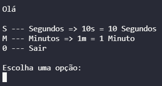

# Projeto Cronometro

## Objetivos

Projeto realizado para estudos

## Funcionalidades

<li>
<lu>Medir intervalos em minutos e segundos no console</lu>
</li>

## Linguagens Utilizadas

<li>
<lu>C#</lu>
</li>

 ## Print do Programa

 </img>

